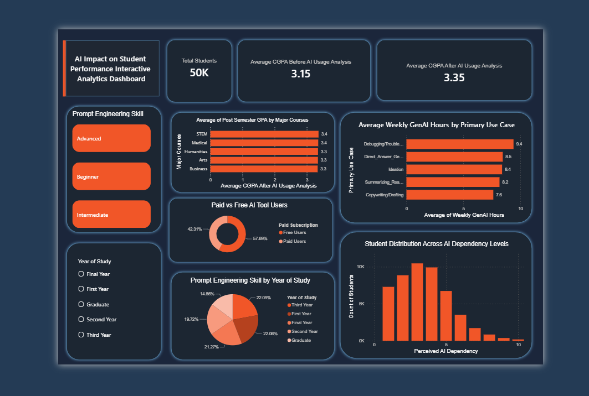

# 🎓 AI Usage Impact on Student Academic Performance

## 📌 Overview

This project analyzes how Generative AI is used by students and its relationship with academic performance, study habits, and learning outcomes. The project follows an end-to-end data analytics workflow, including data cleaning in Python and dashboard development in Power BI.

---

## 🎯 Objectives

- Analyze student AI usage patterns.
- Compare Pre-Semester and Post-Semester GPA.
- Identify the primary use cases of Generative AI.
- Analyze Prompt Engineering Skill across students.
- Understand students' perceived AI dependency.
- Build an interactive Power BI dashboard for data-driven insights.

---

## 🛠️ Tech Stack

- Python
- Pandas
- NumPy
- Jupyter Notebook
- Power BI
- GitHub

---

## 📂 Dataset

- **Records:** 50,000 Students
- **Columns:** 16

### Dataset Features

- Student ID
- Major Category
- Year of Study
- Pre-Semester GPA
- Weekly GenAI Hours
- Primary Use Case
- Prompt Engineering Skill
- Tool Diversity
- Paid Subscription
- Traditional Study Hours
- Perceived AI Dependency
- Institutional Policy
- Anxiety Level During Exams
- Post-Semester GPA
- Skill Retention Score
- Burnout Risk Level

---

## 🧹 Data Preparation

The dataset was cleaned using Python and Pandas.

### Data Cleaning Steps

- Imported the dataset
- Checked data types
- Verified missing values
- Removed duplicate records
- Generated descriptive statistics
- Validated categorical values
- Prepared the dataset for Power BI

---

## 📊 Dashboard Features

- KPI Cards
- Average Pre-Semester GPA
- Average Post-Semester GPA
- Average Weekly AI Usage by Primary Use Case
- Prompt Engineering Skill Distribution
- Paid vs Free Subscription Analysis
- Students' Perceived AI Dependency
- Interactive Slicers

---

## 💡 Key Insights

- Students showed a higher average Post-Semester GPA than Pre-Semester GPA.
- AI usage varies across different academic activities.
- Most students rated their perceived AI dependency as **3/10**, suggesting AI is viewed as a supportive learning tool rather than a primary dependency.
- Prompt engineering skills differ across years of study.

## 📸 Dashboard Preview

## 📈 Skills Demonstrated

- Data Cleaning
- Data Analysis
- Exploratory Data Analysis (EDA)
- Data Visualization
- Dashboard Design
- Business Intelligence
- Power BI
- Python
- Pandas

---

## 👤 Author

**Jaiwin Raj**

Aspiring Data Analyst

- GitHub: *(https://github.com/Jaiwina7)*
- LinkedIn: *(https://www.linkedin.com/in/jaiwin-raj-k-578854291/)*

---

⭐ If you found this project useful, feel free to explore the repository and connect with me on LinkedIn.
